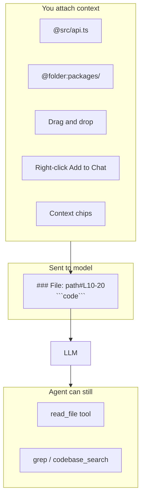

# File & folder context

How Rubynod gives the AI your files and folders.

## Two layers



**Pinned context** = file content is copied into the message before the model runs.  
**Tools** = agent fetches more files during the reply.

---

## Files

### Ways to attach a file

| Action | Rubynod |
|--------|---------|
| Type `@path/to/file.ts` | Parsed when you send |
| Line range `@file.ts:10-42` | Only those lines with line numbers |
| **@** button → @file | Multi-select dialog |
| Explorer right-click | **Rubynod: Add to Chat** |
| Editor + selection | **Add Selection to Chat** |
| Drag into chat | Drop zone |
| Active file (setting) | `rubynod.chat.includeActiveFile` |

### Format sent to the AI

```markdown
### File: packages/rubynod-ai/src/agent.ts#L29-32
```ts
29|function formatContext(ctx) {
...
```
```

---

## Folders

### Ways to attach a folder

| Action | Rubynod |
|--------|---------|
| `@folder:packages/api` | In chat text |
| `@packages/api/` | Trailing slash = folder |
| **@** autocomplete | Pick folder from list |
| Explorer right-click folder | **Rubynod: Add Folder to Chat** |
| @ button → @folder | Folder picker |

### What the AI gets for a folder

1. **Directory tree** (structure, depth-limited)  
2. **Prioritized files** — open tabs first, then smaller text files  
3. **File contents** (capped per file and total file count)

Large files are listed but not fully inlined — use `@big-file.ts:1-50` for a slice.

Settings (future): `rubynod.chat.maxFolderFiles` — today defaults in code (30 files).

---

## @ autocomplete

While typing in chat:

1. Type `@` then start a path → dropdown of files/folders  
2. **↑ / ↓** to select, **Enter** to attach  
3. **Escape** to close  

Extension searches the workspace (respects `node_modules` / `.git` exclusions).

---

## Context chips

Attached files/folders show as chips above the input:

- **📄** file — click chip to **open in editor**  
- **📁** folder  
- **×** to remove before sending  

---

## Settings

```json
{
  "rubynod.chat.includeActiveFile": false,
  "rubynod.chat.includeOpenFiles": false,
  "rubynod.chat.maxFileContextChars": 48000,
  "rubynod.chat.maxContextAttachments": 20
}
```

---

## Feature checklist

| Feature | Rubynod |
|---------|---------|
| @file | Yes |
| @file:lines | Yes |
| @folder | Yes (`@folder:` or `path/`) |
| @ autocomplete | Yes |
| Drag-drop | Yes |
| Right-click file | Yes |
| Right-click folder | Yes |
| Chips + open file | Yes (click chip) |
| Active file auto | Yes (setting) |
| Open tabs list | Yes (setting) |
| @codebase | Yes (index + auto-inject) |
| @symbol | Yes (`@symbol:name`) |
