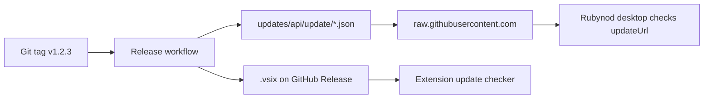

# Releases and auto-update (VS Code style)

Rubynod uses **GitHub Releases** plus static **update manifests** so the desktop app and extension can notify users when a new version is published.

## How it works



| Component | Update source |
|-----------|----------------|
| **Rubynod desktop** (Code-OSS fork) | `product.json` → `updateUrl` + `/api/update/{platform}/{quality}/{commit}` |
| **Rubynod AI extension** (VS Code) | GitHub Releases API + optional `updates/latest.json` |
| **Download page** | `product.json` → `downloadUrl` → GitHub Releases |

## One-time GitHub setup

1. Create a repo on GitHub (e.g. `your-org/rubynod`).
2. **`product.json`** is configured for **`rohitpatil7892/rubynod`**. If you fork elsewhere, edit:
   - `reportIssueUrl`
   - `updateUrl` → `https://raw.githubusercontent.com/YOUR_ORG/rubynod/main/updates`
   - `downloadUrl` → `https://github.com/YOUR_ORG/rubynod/releases`
3. Set extension setting **`rubynod.update.githubRepo`** to `YOUR_ORG/rubynod` (or rely on default after you change it in `package.json`).
4. Push the repo to GitHub.

## Publishing a new version

```bash
# 1. Bump version everywhere
node scripts/sync-version.mjs 0.2.0

# 2. Commit, tag, push
git add -A && git commit -m "chore: release v0.2.0"
git tag v0.2.0
git push origin main --tags
```

The **Release** workflow (`.github/workflows/release.yml`) will:

1. Build all packages  
2. Package `rubynod-ai-ui-0.2.0.vsix`  
3. Regenerate `updates/api/update/...` manifests with download URLs  
4. Commit manifests to `main` (for `raw.githubusercontent.com`)  
5. Create a **GitHub Release** with the VSIX attached  

## Desktop app update notification

In `product.json`:

```json
"updateUrl": "https://raw.githubusercontent.com/YOUR_ORG/rubynod/main/updates",
"downloadUrl": "https://github.com/YOUR_ORG/rubynod/releases",
"quality": "stable",
"commit": "rubynod-dev"
```

The fork requests:

`{updateUrl}/api/update/darwin/stable/rubynod-dev.json`

When `productVersion` in that JSON is newer than the running app, VS Code shows **“There is an available update”** (same UX as VS Code).

### Attaching desktop installers

Upload platform zips to the GitHub Release with these names (or pass custom URLs to the manifest script):

| Asset | Manifest flag |
|-------|----------------|
| `Rubynod-darwin-arm64.zip` | `--darwin-arm64-url` |
| `Rubynod-darwin-x64.zip` | `--darwin-x64-url` |
| `Rubynod-win32-x64.zip` | `--win32-x64-url` |
| `Rubynod-linux-x64.zip` | `--linux-x64-url` |

Regenerate manifests manually:

```bash
node scripts/generate-update-manifest.mjs \
  --version 0.2.0 \
  --repo YOUR_ORG/rubynod \
  --darwin-arm64-url "https://github.com/YOUR_ORG/rubynod/releases/download/v0.2.0/Rubynod-darwin-arm64.zip"
```

After building the Code-OSS fork, copy `product.json` into `vscode-fork/` (`npm run setup:fork` does this).

## Extension update notification

When using Rubynod AI in VS Code:

- Checks **GitHub Releases** on startup and every 12 hours (configurable).
- Shows: *“A new version of Rubynod is available: v0.2.0”* with **View release** / **Download extension**.
- Command: **Rubynod: Check for Updates**

Settings:

| Setting | Default |
|---------|---------|
| `rubynod.update.enabled` | `true` |
| `rubynod.update.githubRepo` | `rohitpatil7892/rubynod` |
| `rubynod.update.checkIntervalHours` | `12` |

## CI vs Release

| Workflow | Trigger | Purpose |
|----------|---------|---------|
| `ci.yml` | push / PR | Build + health check on macOS, Linux, Windows |
| `release.yml` | tag `v*` | Release assets + update manifests |

## Optional: Open VSX

To publish the extension to [Open VSX](https://open-vsx.org/) for marketplace-style updates inside VS Code, add `OVSX_PAT` secret and a publish step — see Open VSX docs.
